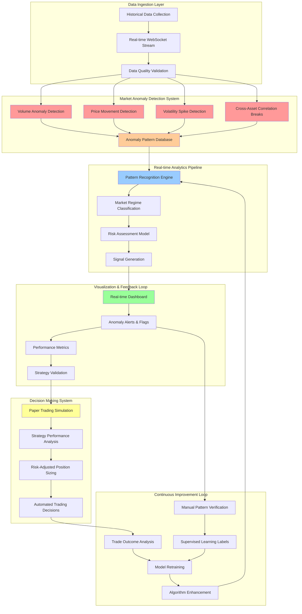

# Stock Market Anomaly Detection Pipeline

Real-time anomaly detection system for stock market data with production-grade MLOps infrastructure.

## Project Overview

This project implements a complete anomaly detection pipeline for stock market data, featuring:

- Real-time data ingestion from Polygon.io API
- Feature store implementation with Feast
- ML models: Isolation Forest and LSTM Autoencoder
- MLflow for experiment tracking and model registry
- FastAPI serving with Redis caching
- SHAP-based interpretability
- Real-time monitoring dashboard

## Tech Stack

- **Data Source**: Polygon.io API (WebSocket + REST)
- **Feature Store**: Feast
- **ML Framework**: scikit-learn, TensorFlow/Keras
- **MLOps**: MLflow
- **API**: FastAPI
- **Caching**: Redis
- **Monitoring**: Streamlit
- **Interpretability**: SHAP

## Project Structure

```
├── data/
│   ├── raw/          # Raw market data
│   ├── processed/    # Cleaned and preprocessed data
│   └── features/     # Feature store data
├── src/
│   ├── data/         # Data ingestion and processing
│   ├── features/     # Feature engineering
│   ├── models/       # ML models and training
│   └── api/          # FastAPI application
├── notebooks/
│   └── exploration/  # Data exploration and analysis
├── configs/          # Configuration files
├── tests/           # Unit and integration tests
├── deployment/      # Docker and Kubernetes configs
│   ├── docker/
│   └── kubernetes/
├── monitoring/      # Monitoring and alerting
└── docs/           # Documentation
    ├── daily-reviews/  # Daily progress reviews
    └── time-invested/  # Time tracking and productivity metrics
```

## Getting Started

### Prerequisites

- **Python 3.10+** (tested with 3.10.12)
- **Polygon.io API key** (free tier: 10,000 calls/month)
- **Git** for version control
- Redis server (for future caching implementation)
- Docker (optional, for containerized deployment)

### Installation

1. Clone the repository:
```bash
git clone https://github.com/JohnYanez95/stock-market-anomaly-detection.git
cd stock-market-anomaly-detection
```

2. Create virtual environment and install dependencies:
```bash
python3 -m venv venv
source venv/bin/activate  # On Windows: venv\Scripts\activate
pip install -r requirements.txt

# Install MLOps packages separately (due to dependency conflicts)
pip install mlflow feast
```

3. Set up environment variables:
```bash
cp .env.example .env
# Edit .env with your Polygon.io API key and subscription tiers
```

**Environment Configuration**:
```bash
# Required: Your Polygon.io API key
POLYGON_API_KEY=your_api_key_here

# Per-asset subscription tiers (basic, starter, developer, advanced)
# WebSocket requires at least 'starter' tier for each asset type
POLYGON_TIER_STOCKS=starter     # Enable for WebSocket access
POLYGON_TIER_CRYPTO=basic       # Basic = no WebSocket
POLYGON_TIER_INDICES=basic      # Basic = no WebSocket
POLYGON_TIER_FOREX=basic        # Basic = no WebSocket
POLYGON_TIER_OPTIONS=basic      # Basic = no WebSocket
```

### Quick Start

1. **Data Collection**:
```bash
# Activate virtual environment
source venv/bin/activate

# Collect sample data (AAPL, GOOGL, MSFT, TSLA, VOO)
python src/data/collect_data.py
```

2. **Data Schema Analysis**:
```bash
# Comprehensive analysis of collected data
python notebooks/exploration/data_schema_analysis.py
```

3. **Real-Time Streaming** (requires Polygon.io Starter plan for stocks):
```bash
# Test WebSocket configuration
python configs/websocket_config.py

# Start real-time streaming with anomaly detection
python src/data/stream_data.py
```

4. **Real-Time Dashboard** (launch during market hours for live data):
```bash
# Launch interactive dashboard with live streaming data
streamlit run monitoring/dashboard.py
```

5. **Feature Engineering**:
```bash
python src/features/build_features.py
```

6. **Model Training**:
```bash
python src/models/train_model.py
```

7. **Start API Server**:
```bash
uvicorn src.api.main:app --reload
```

## Real-Time Streaming

### WebSocket Configuration

The project supports real-time data streaming from multiple asset types with individual subscription management:

**Supported Asset Types**:
- **Stocks** (NYSE, NASDAQ)
- **Crypto** (Bitcoin, Ethereum, etc.)
- **Forex** (Currency pairs)
- **Indices** (S&P 500, NASDAQ, etc.)
- **Options** (Equity options)
- **Futures** (Commodity and financial futures)

**Subscription Requirements**:
- **Basic Tier** (Free): REST API only, no WebSocket access
- **Starter Tier** ($29/month per asset): 15-minute delayed WebSocket streaming
- **Developer Tier** ($79/month per asset): Real-time WebSocket streaming
- **Advanced Tier** ($199/month per asset): Real-time + additional features

### Configuration Examples

**Stocks Only** (Current Setup):
```bash
POLYGON_TIER_STOCKS=starter     # WebSocket enabled
POLYGON_TIER_CRYPTO=basic       # REST API only
```

**Multi-Asset Setup**:
```bash
POLYGON_TIER_STOCKS=starter     # 15-min delayed streaming
POLYGON_TIER_CRYPTO=developer   # Real-time crypto streaming
POLYGON_TIER_FOREX=starter      # 15-min delayed forex
```

**Testing Your Configuration**:
```bash
# Check what's available with your current subscriptions
python configs/websocket_config.py

# Test streaming (will show errors for unsupported assets)
python src/data/stream_data.py
```

### Live Anomaly Detection

Currently implemented anomaly detection:
- **Volume Spikes**: Detects when trading volume exceeds 3x the recent average
- **Real-time Alerts**: Immediate notification when anomalies are detected
- **Multi-symbol Monitoring**: Simultaneously track multiple assets

Example output during market hours:
```
📊 AAPL: $245.09, Vol: 1,097 at 14:32:15
🚨 ANOMALY: volume_spike in AAPL - 9.46x normal
📊 TSLA: $425.30, Vol: 4,441 at 14:32:30
🚨 ANOMALY: volume_spike in TSLA - 3.78x normal
```

## Current Status

**✅ Completed (Week 1)**
- Environment setup with Python 3.10 virtual environment
- All dependencies installed (TensorFlow, scikit-learn, FastAPI, MLflow, Feast)
- Polygon.io API integration working
- Historical data collection implemented
- Sample dataset collected: 5 symbols, ~17,678 total records
- **Data schema fully analyzed**: OHLC prices, volume, VWAP, transaction counts
- **Volatility analysis**: TSLA (48.23%), GOOGL (19.69%), AAPL (15.95%), MSFT (17.89%), VOO (7.36%)
- **Anomaly patterns identified**: Volume spikes, price movements, correlation analysis
- **Real-time WebSocket streaming implemented** with modular configuration
- **Volume anomaly detection working in real-time**

**📊 Available Data & Analysis**
- **AAPL**: 3,762 records, 15.95% volatility, 53 volume spikes detected
- **GOOGL**: 3,522 records, 19.69% volatility, 59 volume spikes detected
- **MSFT**: 3,120 records, 17.89% volatility, 33 volume spikes detected  
- **TSLA**: 4,700 records, 48.23% volatility, 95 volume spikes, 2 large price moves (>5%)
- **VOO**: 2,574 records, 7.36% volatility, 14 volume spikes (stable ETF behavior)
- **Coverage**: Sep 11-17, 2025 (6.7 days), minute-level granularity
- **Quality**: No missing values, all OHLC consistency checks passed

**🔄 Real-Time Streaming**
- **WebSocket Integration**: Production-ready client with Polygon.io Starter plan
- **Multi-Asset Support**: Stocks, crypto, forex, indices, options, futures
- **Per-Asset Subscriptions**: Individual tier management via environment configuration
- **Live Anomaly Detection**: Volume spikes detected in real-time (3x+ threshold)
- **Data Quality**: 15-minute delayed data with consistent OHLC structure

**🚧 Next Steps**
- Real-time monitoring dashboard (Streamlit) - immediate visual feedback
- Enhanced anomaly detection algorithms (price movements, correlation breaks)
- Feature engineering pipeline for streaming data
- Paper trading simulation system

## Development Philosophy

This project follows an **interconnected CI/CD approach** where each component builds upon and enhances the others, with anomaly detection serving as our foundation for market behavior profiling and trading signal generation:



**🔄 The Interconnected CI/CD Flow:**

1. **Anomaly Detection as Foundation** → Unusual market patterns become labeled data for behavior profiling
2. **Real-time Dashboard** → Immediate visual feedback drives algorithm enhancement  
3. **Advanced Analytics** → Pattern recognition engine learns from observed anomalies
4. **Paper Trading** → Decision system validates strategies based on anomaly patterns
5. **Continuous Learning** → Trade outcomes and manual verification improve anomaly detection

**Why This Approach Works:**
- **Anomaly-Driven Learning**: Each detected anomaly becomes training data for trading signal generation
- **Visual Debugging**: Dashboard provides immediate feedback for algorithm refinement
- **Risk-First Development**: Test with paper trading before real capital deployment
- **Continuous Model Improvement**: Performance feedback loops enhance anomaly detection
- **Market Behavior Profiling**: Build a database of market anomalies and their trading contexts

This mirrors how trading firms build robust systems - starting with anomaly detection, adding visualization for human oversight, then gradually automating decision-making based on validated trading signals.

## Development Roadmap

### Week 1-2: Data Pipeline Foundation + Real-Time Visualization
- [x] Project setup and structure
- [x] Environment setup with virtual environment
- [x] Dependencies installed (ML, MLOps, API frameworks)
- [x] Polygon.io API integration
- [x] Historical data collection for AAPL, GOOGL, MSFT, TSLA, VOO
- [x] **Data schema comprehensive analysis**
  - [x] Field definitions (OHLC, volume, VWAP, transactions)
  - [x] Volatility analysis and calculation methodology
  - [x] Volume spike detection and patterns
  - [x] Cross-asset correlation analysis
  - [x] Data quality validation
  - [x] API limits and streaming capabilities assessment
- [x] **WebSocket real-time connection**
  - [x] Modular configuration system for per-asset subscriptions
  - [x] Multi-asset support (stocks, crypto, forex, indices, options, futures)
  - [x] Real-time data streaming with 15-minute delay
  - [x] Live volume anomaly detection (3x threshold)
- [ ] **Real-time monitoring dashboard (Streamlit)**
  - [ ] Live price charts and volume visualization
  - [ ] Anomaly detection alerts and flags
  - [ ] Multi-symbol monitoring interface
  - [ ] Performance metrics and statistics
- [ ] Enhanced anomaly detection algorithms (price movements, volatility spikes)

### Week 3-4: Advanced Analytics + ML Pipeline
- [ ] **Advanced streaming analytics**
  - [ ] Rolling correlations and cross-asset analysis
  - [ ] Dynamic volatility estimation
  - [ ] Market regime detection (bull/bear/sideways)
  - [ ] Technical indicators (RSI, MACD, Bollinger Bands)
- [ ] **ML model development**
  - [ ] Isolation Forest implementation
  - [ ] LSTM Autoencoder development
  - [ ] Feature engineering pipeline for streaming data
  - [ ] Backtesting framework with dashboard integration

### Week 5-6: Decision Making + Production Systems
- [ ] **Paper trading simulation**
  - [ ] Strategy implementation based on anomaly detection
  - [ ] Portfolio management and risk controls
  - [ ] Performance tracking and visualization
  - [ ] Strategy optimization through dashboard feedback
- [ ] **Production infrastructure**
  - [ ] MLflow experiment tracking
  - [ ] Model registry and promotion
  - [ ] FastAPI endpoint development
  - [ ] Feast feature store setup

### Week 7-8: Refinement + Advanced Strategies
- [ ] **Strategy enhancement**
  - [ ] Multi-asset arbitrage detection
  - [ ] Cross-market correlation trading
  - [ ] Risk-adjusted position sizing
- [ ] **Production polish**
  - [ ] SHAP implementation for model interpretability
  - [ ] Performance optimization
  - [ ] Comprehensive documentation and blog post
  - [ ] Live dashboard demonstrations

## 📚 Documentation

**Daily Reviews**: Detailed session summaries in `docs/daily-reviews/`
- **[2025-09-18 Review](docs/daily-reviews/2025-09-18-review.md)**: Data schema exploration and analysis
- Key insights: VWAP formula, volatility calculation, volume vs transactions, API limits

**Time Investment**: Productivity tracking in `docs/time-invested/`
- **[Time Tracking Overview](docs/time-invested/README.md)**: Project timeline and efficiency metrics
- **[2025-09-18 Session](docs/time-invested/2025-09-18.md)**: 2.5 hours, data analysis focus

**Analysis Scripts**: 
- `notebooks/exploration/data_schema_analysis.py`: Comprehensive data analysis tool
- `src/data/collect_data.py`: Historical data collection from Polygon.io
- `src/data/stream_data.py`: Real-time WebSocket streaming with anomaly detection
- `configs/websocket_config.py`: Multi-asset subscription configuration system

## Contributing

1. Fork the repository
2. Create a feature branch
3. Make your changes
4. Add tests
5. Submit a pull request

## License

MIT License - see LICENSE file for details

## Contact

For questions or suggestions, please open an issue.